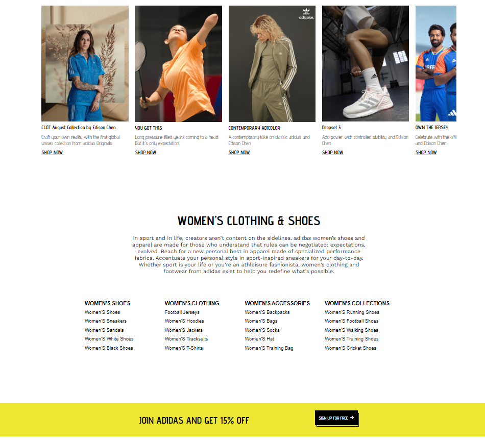

# Project Title
Adidas Clone Project

## Introduction
This project is an Adidas Clone designed to replicate the look and functionality of an e-commerce website like Adidas. The primary goal is to provide users with a seamless shopping experience, including features such as adding items to the cart, marking items as wishlist favorites, and using Firebase for user authentication. The core functionalities involve rendering JSON data for products, managing cart operations, and saving user preferences using local storage.

## Project Type
Frontend | Backend | Fullstack

## Deplolyed App


## Directory Structure
```
src/
├─ images/
│
├─ js/
│   ├─ cart.js
│   ├─ kidHome.js
│   ├─ menHome.js
│   ├─ product.js
│   ├─ toogle.js
│   ├─ wishlist.js
│   ├─ womenHome.js
├─ main/
│   ├─ cart.html
│   ├─ kidHome.html
│   ├─ menHome.html
│   ├─ product.html
│   ├─ rakhi_login_page.html
│   ├─ signup.html
│   ├─ wishlist.html
│   ├─ womenHome.html
├─ styles/
│   ├─ cart.css
│   ├─ kidHome.css
│   ├─ menHome.css
│   ├─ style.css
│   ├─ product.css
│   ├─ wishlist.css
│   ├─ womenHome.css
├─ index.html
└─ readme.md

```


## Video Walkthrough of the project
Attach a very short video walkthough of all of the features [ 1 - 3 minutes ]

## Video Walkthrough of the codebase
Attach a very short video walkthough of codebase [ 1 - 5 minutes ]

## Features
The Adidas clone application includes the following key features:

- Product Listings: Dynamic rendering of product lists for different categories (e.g., men, kids).
- Wishlist Functionality: Users can add items to a wishlist from any page, with a dedicated wishlist page to view and manage these items.
- Cart Management: Users can add items to the cart, view the cart, and see the total number of items and their price.
- Local Storage for Data Persistence: Product and cart information is stored locally to retain user selections between sessions.
- Firebase Authentication: Basic user authentication to manage personalized wishlist and cart data.

## design decisions or assumptions
- Responsive Design: The application is designed to be responsive, ensuring usability across various devices and screen sizes.
- Local Storage: Used to simulate backend functionality for storing cart and wishlist data. This decision helps in maintaining a lightweight frontend-only architecture.
- Firebase for Authentication: Chosen for simplicity and scalability, allowing easy integration and management of user authentication.

## Installation & Getting started
To get the Adidas clone running on your local machine, follow these steps:

1. Clone the repository:
    ```bash
    git clone https://github.com/Mihirvetal/binary-bawlers-033/tree/main
    cd binary-bawlers-033/src
    ```
2. Open the index.html file in your web browser to start exploring the application.


## Usage
To interact with the Adidas clone:

- Browse Products: Navigate through different product categories using the provided navigation links (Men, Kids).
- Add to Wishlist: Click the wishlist icon on any product to add it to your wishlist.
- View Cart: Add products to your cart and navigate to the cart page to view items and their prices.

## ScreenShots





## Credentials
Currently, there is no authentication required for the frontend pages. If implementing Firebase authentication, provide test credentials for authenticated pages.

## APIs Used
No external APIs are used for product data; instead, JSON data is rendered using JavaScript. Firebase is used for authentication.

## API Endpoints
Not applicable for this frontend-only project. However, if backend functionality is added later, a list of endpoints will be provided here.
GET /api/items - retrieve all items
POST /api/items - create a new item


## Technology Stack
List and provide a brief overview of the technologies used in the project.

- HTML5
- CSS
- JavaScript
- Firebase (for authentication only)